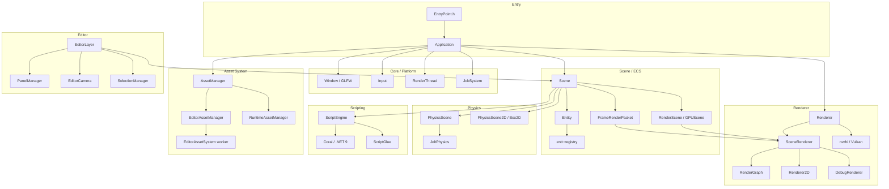

# LuxEngine Architecture Reference

Authoritative structural reference for agents and developers extending LuxEngine.

**This doc is structural, not API-level.** For function signatures, fields, and method lists, read
the header — it is the source of truth and never goes stale. Use this doc for system boundaries,
ownership, lifecycle, threading, extension hooks, and non-obvious invariants.

Companions: `.claude/docs/Conventions.md` (style + helper reuse), `.claude/docs/Building.md` (build
and regeneration), `.claude/docs/Threading.md` (thread contexts), `.claude/docs/Rendering.md`
(renderer invariants).

---

## Table of Contents

- [Part 1: System Overview](#part-1-system-overview)
- [Part 2: Per-System Notes](#part-2-per-system-notes)
- [Part 3: Cross-Cutting Concerns](#part-3-cross-cutting-concerns)
- [Part 4: Implementation Playbook](#part-4-implementation-playbook)
- [Part 5: Directory Map](#part-5-directory-map)

---

## Part 1: System Overview

LuxEngine is a C++20, Vulkan-only 3D game engine and editor. It is a solo project. It builds as a
static library (`Core`), a C# scripting assembly (`ScriptCore`), an editor application (`Editor`),
and a standalone runtime player (`Lux-Runtime`). Everything lives in the `Lux` C++ namespace.



### System summary

| System | Location | Key headers |
|---|---|---|
| Application / Core | `Core/Source/Lux/Core/` | `Application.h`, `Layer.h`, `RenderThread.h`, `JobSystem.h`, `Ref.h`, `Base.h` |
| Window / Platform | `Core/Source/Lux/Core/`, `Core/Platform/{Windows,Linux}/` | `Window.h`, `Thread.h` |
| Renderer | `Core/Source/Lux/Renderer/` | `Renderer.h`, `SceneRenderer.h`, `RenderGraph.h`, `FrameRenderPacket.h` |
| Vulkan backend | `Core/Source/Lux/Platform/Vulkan/` | `VulkanDeviceManager.h`, `DescriptorSetManager.h`, `ShaderCompiler/` |
| Scene / ECS | `Core/Source/Lux/Scene/` | `Scene.h`, `Entity.h`, `Components.h`, `SceneSerializer.h` |
| Physics 3D | `Core/Source/Lux/Physics/` (+ `JoltPhysics/`) | `PhysicsSystem.h`, `PhysicsScene.h`, `PhysicsShapes.h` |
| Physics 2D | `Core/Source/Lux/Physics2D/` | via `Scene.h` |
| Scripting | `Core/Source/Lux/Scripting/` | `ScriptEngine.h`, `ScriptGlue.h`, `ScriptBuilder.h` |
| Assets | `Core/Source/Lux/Asset/` | `AssetManager.h`, `Asset.h`, `AssetTypes.h` |
| Audio | `Core/Source/Lux/Audio/` | `AudioEngine.h`, `AudioSource.h`, `RaytracedAudioScene.h` |
| Editor framework | `Core/Source/Lux/Editor/` | `EditorPanel.h`, `PanelManager.h`, `EditorCamera.h`, `SelectionManager.h` |
| Editor app | `Editor/Source/` | `EditorLayer.h`, `Panels/` |
| ImGui | `Core/Source/Lux/ImGui/` | `ImGuiEx.h`, `ImGuiUtilities.h`, `Colors.h` |
| Project | `Core/Source/Lux/Project/` | `Project.h`, `ProjectSerializer.h`, `UserPreferences.h` |
| Serialization | `Core/Source/Lux/Serialization/` | `AssetPack.h`, `StreamReader/Writer.h` |
| Social | `Core/Source/Lux/Social/` | `DiscordSocial.h` |
| Build | repo root | `premake5.lua`, `Dependencies.lua`, `scripts/` |

### System dependency rules

Violations block the editor/runtime split and are rejected in review.

| System | May depend on | Must NOT depend on |
|---|---|---|
| Scene / ECS | Asset, Physics, Core, Renderer *types* | `Editor/Source/**` |
| Physics | Scene (read), Core, Math | Renderer, Editor, ScriptEngine |
| Renderer / SceneRenderer | Scene (read, via packet), Asset, Core | `Editor/Source/**`, Physics, ScriptEngine |
| ScriptEngine | Scene, Asset, Core (via ScriptGlue) | Renderer, `Editor/Source/**` |
| Asset system | Core, Project | Renderer internals, `Editor/Source/**` |
| Editor panels | everything in `Core` | — (engine code never includes editor-app headers) |

Two notes specific to LuxEngine:

- `Scene.h` includes `Lux/Editor/EditorCamera.h` and `Renderer2D.h`. That is allowed: those are
  `Core`-owned editor *framework* types, not the editor application. The prohibition is on
  `Editor/Source/**`.
- `Core` must remain buildable and usable without `Editor`. `Lux-Runtime` is the proof — if a change
  breaks the runtime build, the dependency direction was violated.

---

## Part 2: Per-System Notes

### 2.1 Application lifecycle

`Application` (`Core/Source/Lux/Core/Application.h`) owns the window, layer stack, render thread,
event queue, application settings, and performance profiler. The client implements
`CreateApplication(argc, argv)` (see `EntryPoint.h`).

`ApplicationSpecification` carries name/size/vsync/fullscreen, `RendererConfig`,
`CoreThreadingPolicy`, `EnableSimulationThread`, `EnableImGui`, `EnableDiscordRichPresence`, and
`IconPath`.

**Construction order matters** and is not obvious: `s_MainThreadID` is captured, settings are
deserialized, `JobSystem::Init` runs, then `m_RenderThread.Run()`, and only *then* is the `Window`
created. The threading policy is therefore read from `App.lsettings` in `LuxEditorApp.cpp` *before*
the `Application` object exists, because `RenderThread` is constructed with it.

**Layers** (`Layer.h`, `LayerStack.h`): `OnAttach` / `OnDetach` / `OnUpdate(Timestep)` /
`OnImGuiRender` / `OnEvent`. `PushLayer` for regular, `PushOverlay` for top. The editor and the
runtime each supply one.

**Frame loop** — see `.claude/docs/Threading.md § The frame loop` for the exact ordering. Do not add
per-frame work directly to `Application::Run`; add it to a layer's `OnUpdate`.

**Events** are two-stage: `QueueEvent` / `DispatchEvent<T>` are thread-safe and deferred until
`SyncEvents()`; `DispatchEvent<T, true>` dispatches immediately (main thread only).

### 2.2 Window / Platform

`Window` (`Core/Source/Lux/Core/Window.h`) is created via `Window::Create(WindowSpecification)` and
owns the GLFW window, the `RendererContext`, and the `DeviceManager`.
`Application::GetGraphicsDeviceManager()` / `GetGraphicsDevice()` are the shortcuts to the nvrhi
device.

Platform-specific implementations are separate translation units under
`Core/Platform/Windows/` and `Core/Platform/Linux/` (`*FileSystem.cpp`, `*Thread.cpp`,
`*RenderThread.cpp`), selected by a premake glob on `os.target()`. Add a platform behaviour by adding
the file to **both** folders — not with `#ifdef` in shared code.

### 2.3 Renderer

Three layers (`Renderer` facade → `SceneRenderer` → `Renderer2D`/`DebugRenderer`) over NVRHI/Vulkan.

**Read `.claude/docs/Rendering.md` before changing anything here.** The invariants that are easy to
break and hard to see: the global `(set, binding)` namespace, pipeline caching, frame-indexed
resource release, and `RenderGraph::ComputeStructureHash` completeness.

Structurally:

- `SceneRenderer` owns a `RenderGraph` and rebuilds its description each frame, caching the compile
  behind a structure hash. The pipeline is deferred PBR: G-buffer, clustered (froxel) light culling,
  HZB + GPU mesh culling, GTAO, SSR, volumetric clouds, sky atmosphere, transparent forward, then
  post (TAA, auto-exposure, bloom, composite, SMAA, DOF).
- `RenderScene` / `GPUScene` / `MaterialScene` / `TextureScene` hold the persistent render-side
  mirror of the ECS, with `StaticMeshRenderProxy` entries and dirty flags. `Scene::SyncRenderScene`
  maintains them.
- `FrameRenderPacket` is the per-frame snapshot that decouples submission from the live registry.
- `RendererConfig::FramesInFlight` defaults to 3.

### 2.4 Scene / ECS

`Scene` (`Core/Source/Lux/Scene/Scene.h`) derives `Asset` and owns the `entt::registry`, the
`Renderer2D`, the physics scenes (`PhysicsScene` 3D, `PhysicsScene2D`), the `ScriptStorage` and live
`CSharpObject` instances, runtime audio sources, and the UUID→entity map.

`Entity` (`Entity.h`) is a thin wrapper over `entt::entity` + `Scene*` with
`AddComponent<T>` / `GetComponent<T>` / `TryGetComponent<T>` / `HasComponent<T...>` /
`RemoveComponent<T>`. Templates live in `EntityTemplates.h`, included at the bottom of `Scene.h`.

**Components** (`Components.h`): `IDComponent`, `TagComponent`, `TransformComponent`,
`RelationshipComponent`; rendering (`MeshComponent`, `StaticMeshComponent`, `SubmeshComponent`,
`MeshTagComponent`, `SpriteRendererComponent`, `CircleRendererComponent`, `TextComponent`,
`CameraComponent`); lighting (`DirectionalLightComponent`, `PointLightComponent`,
`SpotLightComponent`, `SkyLightComponent`, `SkyAtmosphereComponent`, `VolumetricCloudComponent`,
`ExponentialHeightFogComponent`); physics 3D (`RigidBodyComponent`, `CharacterControllerComponent`,
`Box`/`Sphere`/`Capsule`/`Mesh`/`CompoundColliderComponent`); physics 2D (`RigidBody2DComponent`,
`BoxCollider2DComponent`, `CircleCollider2DComponent`); scripting (`ScriptComponent`,
`NativeScriptComponent`); audio (`AudioSourceComponent`, `AudioListenerComponent`);
`FolderComponent` (a purely organizational hierarchy grouping node — non-empty marker, kept out of
the transform/render paths); and `PrefabComponent`.

**Prefab instances:** an instantiated (or freshly created) prefab hierarchy carries a
`PrefabComponent{PrefabID, EntityID}` on every entity, linking each to its source entity inside the
prefab asset's scene. `SceneSerializer::GetOverriddenComponentKeys(instance, source)` diffs the two
entities' serialized component blocks to surface per-component overrides in the inspector, and
`Scene::ReconcilePrefabComponents(dst, src)` makes one entity's prefab-tracked components match the
other exactly (replace/add/remove) — together backing the editor's per-component and all-at-once
**Revert** (source → instance) / **Apply** (instance → source, then re-serialize the asset). True
**Variant prefabs** are self-contained prefabs that carry a `BasePrefab` handle (`Prefab::GetBasePrefab`),
serialized as an optional top-level `BasePrefab` key by `PrefabSerializer::WritePrefabFile` (the single
prefab-write path, so the base link survives every save). A variant instantiates like any prefab; on
saving a base, `EditorLayer::PropagateToVariants` refreshes each derived variant asset via
`Scene::AdoptPrefabBaseEdits` (UUID-matched, un-overridden entities adopt the base edit). **Prefab edit mode**
(EditorLayer) swaps the editing context to a copy of the prefab's scene (`ApplyEditorScene`, shared
with `OpenScene`); on save it writes the asset and calls `Scene::PropagatePrefabEdits`, which
refreshes un-overridden instances in the returned scene to the edited prefab's values.

**Lifecycle:** `OnRuntimeStart` / `OnRuntimeStop` (physics + scripts), `OnSimulationStart` /
`OnSimulationStop` (physics only), and the per-mode updates `OnUpdateRuntime` /
`OnUpdateSimulation` / `OnUpdateEditor`.

**Rendering entry points:** `OnRenderEditor` / `OnRenderSimulation` / `OnRenderRuntime`, built on
`BuildRenderPacket*` + `SubmitRenderPacket`. `Render3D` / `Render3DRuntime` are the higher-level
orchestrators.

**Conventions:**

- `UUID` is stable across save/load and scene copies; `entt::entity` handles are not. Identify by
  UUID anywhere that crosses a frame, a file, or a duplication.
- The registry is **not** thread-safe; mutation is main-thread only.
- Destroying an entity mid-iteration invalidates views — use `SubmitToDestroyEntity`, which defers
  into `m_PostUpdateQueue`.
- `Scene::Copy` / `CopyTo` back play-mode duplication; a component that isn't copied there silently
  vanishes on Play.

### 2.5 Physics (3D — Jolt)

Layered so the backend can be swapped:

- `PhysicsAPI` (`PhysicsAPI.h`) — backend interface; `JoltAPI` is the only implementation.
- `PhysicsSystem` (`PhysicsSystem.h`) — static facade: init/shutdown, mesh cooking, scene factory.
- `PhysicsScene` / `PhysicsBody` — the world and its bodies (`JoltScene`-equivalent logic in
  `PhysicsScene.cpp`, `JoltBody`).
- `PhysicsShapes.h` — box, sphere, capsule, convex mesh, triangle mesh (static only), compound.
- `CharacterController.h` / `JoltCharacterController`.
- `PhysicsLayer` / `PhysicsLayerManager` — collision filtering.
- `SceneQueries.h` — raycasts, shape casts, overlaps.
- `MeshCookingFactory` / `MeshColliderCache` — mesh colliders are cooked and cached, not rebuilt.
- `PhysicsCaptureManager`, `PhysicsContactCallback`, `PhysicsSettings`.

Stepping is driven by `Scene::StepPhysics(ts)` from the scene update — there is **no** fixed-phase
scheduler in LuxEngine.

### 2.6 Physics (2D — Box2D)

`Core/Source/Lux/Physics2D/`, driven directly by `Scene` (`OnPhysics2DStart` / `OnPhysics2DStop`).
No abstraction layer — Box2D is small enough to use directly.

### 2.7 Scripting (C# / Coral)

`ScriptEngine` (`Scripting/ScriptEngine.h`) hosts .NET 9 through Coral (`Core/vendor/Coral/`).

- Host lifecycle: `InitializeHost` / `ShutdownHost`, then `Initialize(project)` / `Shutdown`.
- Assemblies: `LoadProjectAssembly` (editor, from disk), `LoadProjectAssemblyRuntime(Buffer)`
  (runtime, from an asset pack), `ReloadAppAssembly` (hot reload), `BuildAssemblyCache`.
- `ScriptGlue.cpp` registers every internal call. **All new internal calls go there** — never in
  `ScriptEngine.{h,cpp}`.
- `ScriptEntityStorage.hpp` holds per-entity field values (`ScriptStorage`, serialized with the
  scene); live objects are `CSharpObject` instances on the `Scene`.
- `ScriptBuilder` shells out to build the project's C# assembly.
- `ScriptFieldMetadata::HasMethod(name)` gates lifecycle invocation so the engine doesn't call hooks
  a script doesn't define.

The Coral host assembly is deployed to `Editor/DotNet/` by `Core`'s premake post-build step (see
`.claude/docs/Building.md`). Managed references are invalidated on reload — never cache them across
frames.

### 2.8 Asset system

`AssetManager` (`Asset/AssetManager.h`) is a **static facade** over `AssetManagerBase`, resolved
through `Project::GetAssetManager()`. Two implementations:

- `EditorAssetManager` — file-backed, owns the `AssetRegistry` (`AssetHandle` → `AssetMetadata`).
- `RuntimeAssetManager` — loads from a packed `AssetPack`.

Asset types (`AssetTypes.h`): `Scene`, `Prefab`, `Mesh`, `StaticMesh`, `MeshSource`, `Material`,
`Texture`, `EnvMap`, `Audio`, `SoundConfig`, `SpatializationConfig`, `Font`, `Script`, `ScriptFile`,
`MeshCollider`, `SoundGraphSound`, `Skeleton`, `Animation`, `AnimationGraph`.

Serializers live beside the importers (`MeshSerializer`, `TextureSerializer`, `MaterialSerializer`,
`SceneAssetSerializer`, `AudioAssetSerializer`, plus `*RuntimeSerializer` variants) and are wired up
in `AssetImporter.cpp`. Extension → type mapping is in `AssetExtensions.h`.

Rules:

- Reference assets by `AssetHandle`, never by path after import.
- Memory-only assets (procedural meshes, runtime textures) are registered with
  `AssetManager::AddMemoryOnlyAsset` and live in a **separate map** (`m_MemoryAssets`, guarded by a
  `std::shared_mutex`), queried via `IsMemoryAsset`. They are *not* marked with a flag —
  `AssetFlag` has only `None`, `Missing`, and `Invalid` (`AssetTypes.h`). Don't look for a
  `MemoryOnly` flag; there isn't one.
- Engine code must work against **both** managers — no editor-only assumptions.
- Async: `GetAssetAsync` + `SyncWithAssetThread()`; the worker is `EditorAssetSystem` /
  `RuntimeAssetSystem` (see `.claude/docs/Threading.md`).
- Dependencies: `RegisterDependency(dep, handle)` so a reloaded texture notifies its materials.

### 2.9 Editor

Split between engine-owned framework (`Core/Source/Lux/Editor/`) and the editor application
(`Editor/Source/`).

- `EditorPanel` (`Core/.../Editor/EditorPanel.h`) — `RefCounted` base with `OnImGuiRender(bool&
  isOpen)`, plus optional `OnEvent`, `OnProjectChanged`, `SetSceneContext`, `OnClose`.
- `PanelManager` — `AddPanel<T>(category, strID, isOpenByDefault, args...)`, `GetPanel<T>(strID)`,
  `RemovePanel`, and `Serialize` / `Deserialize` of open state. Panels are grouped by
  `PanelCategory`.
- `SelectionManager`, `EditorCamera`, `EditorConsolePanel` + `EditorConsole/`,
  `SceneHierarchyPanel`, `EditorResources`, `FontAwesome.h`.
- `EditorStack` (`Core/.../Editor/EditorStack.h`, header-only, main-thread singleton) — undo/redo
  *signal*. It carries a "scene edited" flag; `ImGuiEx::Property` raises it on every field edit (gated
  by the `UndoDo` macro), and non-widget edits call `MarkSceneEdited("label")`. `EditorLayer` turns the
  flag into a **labelled, per-entity diff** step: it splits the scene via
  `SceneSerializer::SerializeEntitySnapshots` (per-entity YAML + meta) and stores only the changed
  entities, so history is O(change). Restore reassembles the full scene and runs the whole-scene
  deserialize (`DeserializeFromSnapshots`), which keeps it safe against the two-way parent/child links.
  Value-based, so nothing dangles. Non-scene edits (renderer/project settings) push closure commands
  (`CustomUndo`/`CustomRedo`, via `EditorLayer::PushUndoCommand`) onto the same stack, so one `Ctrl+Z`
  covers everything. Selection is restored per step; a `UndoHistoryPanel` (View → History) shows the
  stack. Play/Simulate get a separate transient history (discarded on Stop; undo there rebuilds and
  restarts the runtime). Resets on scene load. Full design + phased plan: `docs/Editor/Undo-Redo.md`.
- Editor app panels (`Editor/Source/Panels/`): ContentBrowser (+ `ContentBrowser/`),
  ApplicationSettings, ProjectSettings, AssetManager, Materials, MaterialEditor, LightSettings,
  SceneRenderer, RenderStats, RendererDebugger, TextEditor, ThumbnailCache.
- `Editor/Source/EditorLayer.{h,cpp}` is the orchestrator. Prefer adding a **panel** over adding code
  to `EditorLayer`.
- `Editor/Source/RuntimeExportUtils.{h,cpp}` builds the standalone runtime package.

UI style: use `ImGuiEx` scopes and widgets and `Colors::Theme` constants — see
`.claude/docs/Conventions.md`.

### 2.10 Audio

miniaudio-backed. `AudioEngine`, `AudioSource`, `AudioListener`, `AudioFileUtils`. `Scene` owns
runtime sources (`GetOrCreateRuntimeAudioSource`, playlists via
`GetOrCreateRuntimePlaylistSource`) and releases them on stop (`ReleaseAllRuntimeAudio`). Components:
`AudioSourceComponent`, `AudioListenerComponent`.

**Ray-traced acoustics (optional):** `RaytracedAudioScene` (`Audio/RaytracedAudioScene.h`) wraps the
Vercidium Audio SDK (`Core/vendor/VA_RAY/`, opt-in via the `--raytraced-audio` premake option,
`LUX_ENABLE_RAYTRACED_AUDIO`) behind a Pimpl, so the header never leaks `vaudio.h` and is safe to
include unconditionally. Built without the option, every method is a no-op (same pattern as
`DiscordSocial` — see `Social/DiscordSocial.cpp`), so call sites need no `#ifdef`.

`Scene` owns one `Ref<RaytracedAudioScene> m_RaytracedAudioScene` (`GetRaytracedAudioScene()`).
`OnRaytracedAudioStart()` checks `RaytracedAudioScene::IsAvailable()` first and returns without
constructing anything if the feature isn't compiled in, so every other `m_RaytracedAudioScene` check
(the per-frame sync in `OnUpdateRuntime`, `ReleaseRuntimeAudio`) short-circuits on a null `Ref` and a
scene built without VA_RAY pays no runtime cost for it. Otherwise it's created in
`OnRaytracedAudioStart()` (called from `OnRuntimeStart`) and torn down in
`OnRaytracedAudioStop()` (`OnRuntimeStop`, and defensively in `~Scene`) — the same start/stop
lifecycle shape as `PhysicsScene`. On start, it walks every `MeshColliderComponent` entity, resolves
the collider's referenced render mesh (`StaticMesh` → `MeshSource`, the same `BaseIndex/3` triangle
walk `PhysicsScene`/`JoltShapes` use for cooking), bakes each triangle into world space, and hands
the flat triangle soup to `RaytracedAudioScene::SetStaticGeometry` — **mirrored once at runtime
start, not kept in sync with moving colliders.** Per-frame, `OnUpdateRuntime` syncs the active
`AudioListenerComponent`'s position/forward and creates/positions one VA emitter per
`AudioSourceComponent` entity with a valid `Audio` handle, then ticks `OnUpdate(ts)`
(`vaWorldUpdate`). The VA listener is a plain emitter used only as an occlusion/reverb *target*
(`vaEmitterAddTarget`) — it never casts its own rays.

`RaytracedAudioScene::GetResult(entityID)` exposes the per-emitter result (`RaytracedAudioResult`:
two-band occlusion gain plus reverb return/decay) for a playback backend to apply. VA computes
acoustic parameters only — it does not play audio itself, so this is a separate system from the
playback backend below.

**Playback backend (optional, dual):** `AudioEngine`/`AudioSource`/`AudioListener` build against
either miniaudio (default) or FMOD Engine Core API (`--fmod`, `LUX_ENABLE_FMOD`, requires
`Core/vendor/FMOD/`), selected by `#ifdef`/`#else` branches within each `.cpp` — both branches
always compile, so call sites (including `Scene`) never see the backend. Same reasoning as
`RaytracedAudioScene`/`DiscordSocial`: the default build never depends on an SDK that isn't checked
out. `AudioEngine::Update()` pumps `FMOD::System::update()` once per frame from `Application::Run`
(no-op under miniaudio, which mixes on its own thread).

Under FMOD, `AudioSource` owns an `FMOD::Sound` + a lazily-created `FMOD::Channel` kept paused
rather than stopped between plays (`Channel::stop()` permanently invalidates an FMOD channel, which
doesn't fit this API's "replay in place" contract), and `Scene::OnUpdateRuntime`'s
`RaytracedAudioScene` sync block feeds `RaytracedAudioResult` straight into
`Channel::set3DOcclusion` and `Channel::setReverbProperties` — the one place VA's acoustic
simulation and FMOD's playback actually connect. `AudioEngine::Init()` creates one ambient,
effectively unbounded `FMOD::Reverb3D` so that per-source reverb send has somewhere to go; per-source
reverb *character* (decay time, roughness) from VA isn't fed into FMOD's reverb properties yet, only
the wet amount. Only the Linux FMOD package has been fetched — the Windows paths in
`Dependencies.lua` are unverified placeholders (see the comment there).

### 2.11 Input

`Core/Source/Lux/Core/Input.h` — static, with `KeyCodes.h` / `MouseCodes.h`. Frame-accurate state is
updated by `Application`.

### 2.12 Project

`Project` (`Project/Project.h`) is `Ref`-counted with a static active-project slot. Path accessors:
`GetActiveProjectDirectory`, `GetActiveAssetDirectory`, `GetActiveAssetRegistryPath`,
`GetActiveCacheDirectory`, `GetActiveMeshPath` / `MeshSourcePath` / `AnimationPath`,
`GetActiveScriptModuleFilePath` / `ScriptProjectPath`, `GetActiveAudioCommandsRegistryPath`,
`GetActiveAssetFileSystemPath(path)`.

`SetActive` (editor) vs `SetActiveRuntime(project, assetPack)` (runtime) choose which asset manager
is installed. `ProjectSerializer` handles `.luxproj`; `UserPreferences` holds machine-local state;
`TieringSettings` / `TieringSerializer` hold quality tiers.

> **Regression trap:** the editor persists renderer quality settings into the project file. When a
> visual regression appears "from nowhere", diff the `.luxproj` before diffing code.

### 2.13 Serialization

YAML (yaml-cpp) for human-readable assets — scenes, prefabs, materials, project settings, tiering.
`Utilities/SerializationMacros.h` provides `LUX_SERIALIZE_PROPERTY`.

Binary for distribution: `Serialization/AssetPack.{h,cpp}` + `AssetPackFile.h` +
`AssetPackSerializer`, `ShaderPackFile.h`, and the stream layer (`FileStream`, `MemoryStream`,
`StreamReader`, `StreamWriter`, `Serialization.h` / `SerializationImpl.h`).

Missing keys must deserialize to the struct default. Never hard-fail a load on an absent optional
field, and never silently drop data on save.

### 2.14 Social (Discord)

`Social/DiscordSocial.{h,cpp}` + `DiscordppImpl.cpp`. Double opt-in: the `--discord` premake flag
(defines `LUX_ENABLE_DISCORD`, requires the manually-fetched, gitignored
`Core/vendor/discord_social_sdk/`) **and** the runtime `Discord.RichPresenceEnabled` setting, which
defaults to off. `DiscordSocial::Update()` is pumped once per frame from `Application::Run`, so all
SDK callbacks land on the main thread and presence state needs no locking.

### 2.15 Reflection

`Reflection/` — `TypeDescriptor.h`, `TypeName.h`, `TypeStructures.h`, `TypeUtils.h`,
`MetaHelpers.h`. Compile-time type-name and structure helpers used by the script and serialization
layers.

---

## Part 3: Cross-Cutting Concerns

### Smart pointers

`Ref<T>` (intrusive, atomic, `RefCounted`), `WeakRef<T>` (liveness-checked, **no** `Lock()`),
`Scope<T>` (`std::unique_ptr` alias). Forbidden: raw `new`/`delete`, `std::shared_ptr`,
`std::make_shared`. Full rules and the double-free hazard in `Ref::DecRef` are in
`.claude/docs/Conventions.md`.

### Events

`Core/Events/` — `Event.h` base plus `ApplicationEvent.h`, `KeyEvent.h`, `MouseEvent.h`,
`SceneEvents.h`, `EditorEvents.h`. Dispatch with `EventDispatcher::Dispatch<T>(fn)`. New event:
add the type, declare the class with the event macros, handle it in the relevant layer's `OnEvent`.
`LUX_BIND_EVENT_FN(fn)` (in `Base.h`) is the binding helper.

### Logging, asserts, profiling

`LUX_CORE_*_TAG` / `LUX_*_TAG` (always tag), `LUX_CORE_ASSERT` (Debug) vs `LUX_CORE_VERIFY` (all
configs), `LUX_PROFILE_*` (Tracy, off in Dist / `--no-tracy`). Details in
`.claude/docs/Conventions.md`.

GPU work is profiled separately: `VulkanDeviceManager` owns a `TracyVkCtx` (created in
`CreateDevice`, destroyed in `DestroyDevice`, exposed by `GetGPUProfilerContext()`), and
`RenderCommandBuffer::RT_BeginTimerQuery` / `RT_EndTimerQuery` emit a Tracy GPU zone alongside the
engine's own nvrhi timer query. This is the only place Tracy's Vulkan header is used outside
`Platform/Vulkan/` — it is deliberately kept out of `Debug/Profiler.h`, which reaches nearly every
translation unit through the PCH. See `.claude/docs/Rendering.md § GPU timing has two consumers`.

### Math

GLM, with `GLM_FORCE_DEPTH_ZERO_TO_ONE` defined for `Core` (Vulkan clip space). Engine helpers under
`Core/Source/Lux/Core/Math/` (frustum, sphere, …) and `Core/Source/Lux/Math/`.

### Error handling

Validate at boundaries — file I/O, user input, deserialization, script interop. Internal call sites
are trusted; don't sprinkle defensive checks for impossible states. Prefer RAII over manual cleanup.
`LUX_CORE_VERIFY` is the assert that survives into Dist; use it for invariants that must hold in a
shipped build.

---

## Part 4: Implementation Playbook

### Add a new component

1. Define the struct in `Scene/Components.h`.
2. Handle copying — `Scene::Copy` / `CopyTo` / `DuplicateEntity` / prefab instantiation. A component
   missed here vanishes on Play or on duplicate.
3. Serialize in `Scene/SceneSerializer.cpp` — **both** serialize and deserialize.
4. Editor UI in `Core/Source/Lux/Editor/SceneHierarchyPanel.cpp` — a collapsing header in
   `DrawComponents` plus an "Add Component" menu entry.
5. If the renderer consumes it, add it to `FrameRenderPacket` and the `BuildRenderPacket*` capture —
   not to a direct ECS read during submission.
6. Optional: C# mirror in `ScriptCore` + internal calls in `ScriptGlue.cpp`.
7. Regenerate projects if you added files (`scripts\Win-GenProjects.bat`).

Skipping any step fails silently: invisible in the editor, lost on save, or dropped on Play.

### Add a new asset type

1. Add to the `AssetType` enum and its to/from-string helpers in `Asset/AssetTypes.h`.
2. Create the asset class deriving `Asset`, with `GetStaticType()` / `GetAssetType()`.
3. Create a serializer deriving `AssetSerializer` (plus a runtime serializer if it ships in an
   asset pack).
4. Register in `Asset/AssetImporter.cpp`.
5. Add the extension mapping in `Asset/AssetExtensions.h`.

### Add a new render pass

See `.claude/docs/Rendering.md § Adding a pass` — the short version: shader in
`Editor/Resources/Shaders/`, pipeline + material created once in `SceneRenderer::Init()`, shader
dependency registered, transient targets via `AddTransientTexture`, pass added with **accurate**
reads/writes, feature-gated so it costs nothing when off. Anything affecting compilation must be
folded into `ComputeStructureHash()`.

### Add a new editor panel

1. Derive `EditorPanel` in `Editor/Source/Panels/` (or `Core/Source/Lux/Editor/` if the engine owns
   it). Implement `OnImGuiRender(bool& isOpen)`; override `SetSceneContext` / `OnProjectChanged` as
   needed.
2. Register in `EditorLayer` via `m_PanelManager->AddPanel<MyPanel>(category, "MyPanelID", true)`.
3. Add the menubar toggle.
4. Regenerate projects.

Prefer a new panel over new code in `EditorLayer`.

### Add a new C# internal call

1. Implement in `Scripting/ScriptGlue.cpp` (naming: `ClassName_MethodName`).
2. Register it in the internal-call registration block in the same file.
3. Add the matching C# declaration in `ScriptCore/Source/Lux/`.
4. Add the C# wrapper that calls it.

Names must match exactly. Validate entity liveness before touching components.

### Add a new thread or background job

Read `.claude/docs/Threading.md` first. Use `Lux::Thread` (named) rather than a bare `std::thread`,
call `LUX_PROFILE_THREAD` at the top of the body, and route any GPU work through `Renderer::Submit`
(which will defer it correctly). Never mutate the ECS or the asset registry off the main thread.

For data-parallel work, prefer `JobSystem::ParallelFor` over spawning a thread.

### Add a new dependency

Edit `Dependencies.lua` — one entry in the `Dependencies` table, with platform-specific library
names under `Windows = { … }` / `Linux = { … }`. `ProcessDependencies()` / `IncludeDependencies()`
iterate it automatically; no manual `links {}` / `includedirs {}` in project files. Then regenerate.

### Add a build toggle

One entry in `scripts/BuildOptions.py`'s `OPTIONS`, plus a matching `newoption` in `premake5.lua`
for a `premake`-kind option. See `.claude/docs/Building.md`.

---

## Part 5: Directory Map

```
luxengine/
├── Core/                          # The engine (StaticLib)
│   ├── Source/
│   │   ├── lpch.h / lpch.cpp      # Precompiled header
│   │   └── Lux/
│   │       ├── Core/              # Application, Window, Layer, Ref, Events, Input,
│   │       │                      #   RenderThread, JobSystem, SimulationThread, Log, UUID, Math
│   │       ├── Renderer/          # Renderer, SceneRenderer, RenderGraph, Renderer2D,
│   │       │                      #   RenderScene/GPUScene, Material, Shader, Pipeline, Mesh, UI/
│   │       ├── Scene/             # Scene, Entity, Components, SceneSerializer, Prefab
│   │       ├── Physics/           # PhysicsSystem/Scene/Body/Shapes + JoltPhysics/
│   │       ├── Physics2D/         # Box2D
│   │       ├── Scripting/         # ScriptEngine, ScriptGlue, ScriptBuilder, ScriptEntityStorage
│   │       ├── Asset/             # AssetManager facade, AssetManager/, AssetSystem/, serializers
│   │       ├── Audio/             # AudioEngine, AudioSource, AudioListener, RaytracedAudioScene
│   │       ├── Editor/            # EditorPanel, PanelManager, EditorCamera, SelectionManager,
│   │       │                      #   SceneHierarchyPanel, EditorConsole/
│   │       ├── ImGui/             # ImGuiLayer, ImGuiEx, ImGuiUtilities, Colors, Fonts, ImGuizmo
│   │       ├── Project/           # Project, ProjectSerializer, UserPreferences, TieringSettings
│   │       ├── Serialization/     # AssetPack, streams, runtime serializers
│   │       ├── Platform/Vulkan/   # nvrhi/Vulkan backend, DescriptorSetManager, ShaderCompiler/, Debug/
│   │       ├── Utilities/         # FileSystem, StringUtils, FileDialogs, CommandLineParser
│   │       ├── Reflection/        # TypeDescriptor / TypeName / TypeUtils
│   │       ├── Debug/             # Profiler.h (Tracy wrappers)
│   │       ├── Social/            # DiscordSocial
│   │       ├── Tiering/           # TieringSerializer
│   │       └── Embed/             # LuxIcon.embed
│   ├── Platform/{Windows,Linux}/  # Per-platform FileSystem / Thread / RenderThread
│   └── vendor/                    # Box2D, JoltPhysics, GLFW, imgui, nvrhi, Coral, tracy,
│                                  #   msdf-atlas-gen, NFD-Extended, yaml-cpp, VMA, FastNoise, …
├── ScriptCore/                    # C# scripting assembly (.NET 9)
├── Editor/
│   ├── Source/                    # EditorLayer, LuxEditorApp, Panels/, Viewport/
│   ├── Resources/Shaders/         # GLSL shader corpus (+ Include/, PostProcessing/)
│   ├── DotNet/                    # Coral host assembly (populated by Core's post-build)
│   └── LuxSampleProject/          # Sample project incl. its C# script solution
├── Lux-Runtime/                   # Standalone runtime player
├── scripts/                       # Setup / Win-GenProjects / Configure / BuildOptions / Linux-*
├── vendor/bin/premake5.exe        # Windows premake (Linux binary is fetched, gitignored)
├── premake5.lua                   # Workspace definition
├── Dependencies.lua               # Centralized dependency table
└── .github/workflows/main.yml     # CI (windows-2025, Debug/Release/Dist)
```

---

## Maintaining this document

When a change alters a system boundary, an interface, an ownership rule, or an integration point,
update the matching section here in the **same** change. When a fact here turns out to be wrong,
fix it rather than working around it — a stale architecture doc is worse than none, because it gets
trusted.

Keep it structural. Function-by-function detail belongs in the header.
